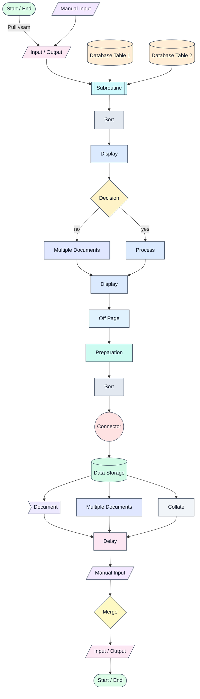

# Mermaid Diagram

```mermaid
flowchart TB
    A[/"Input / Output"/]
    B[["Subroutine"]]
    C[/Manual Input/]
    D(["Start / End"])
    E[("Database Table 1")]
    F[("Database Table 2")]
    G["Sort"]
    H["Display"]
    I{"Decision"}
    J["Process"]
    K["Multiple Documents"]
    L["Display"]
    M["Off Page"]
    N["Preparation"]
    O["Sort"]
    P(("Connector"))
    Q[("Data Storage")]
    R>"Document"]
    S["Multiple Documents"]
    T["Collate"]
    U["Delay"]
    V[/Manual Input/]
    W{"Merge"}
    X[/"Input / Output"/]
    Y(["Start / End"])
    A --> B
    D -->|Pull vsam| A
    C --> A
    E --> B
    F --> B
    B --> G
    G --> H
    H --> I
    I -->|yes| J
    I -.->|no| K
    K --> L
    J --> L
    L --> M
    M --> N
    N --> O
    O --> P
    P --> Q
    Q --> R
    Q --> S
    Q --> T
    R --> U
    S --> U
    T --> U
    U --> V
    V --> W
    W --> X
    X --> Y
    style A fill:#fce7f3,stroke:#334155,color:#111827
    style B fill:#cffafe,stroke:#334155,color:#111827
    style C fill:#f3e8ff,stroke:#334155,color:#111827
    style D fill:#dcfce7,stroke:#334155,color:#111827
    style E fill:#ffedd5,stroke:#334155,color:#111827
    style F fill:#ffedd5,stroke:#334155,color:#111827
    style G fill:#e2e8f0,stroke:#334155,color:#111827
    style H fill:#dbeafe,stroke:#334155,color:#111827
    style I fill:#fef3c7,stroke:#334155,color:#111827
    style J fill:#dbeafe,stroke:#334155,color:#111827
    style K fill:#e0e7ff,stroke:#334155,color:#111827
    style L fill:#dbeafe,stroke:#334155,color:#111827
    style M fill:#e0f2fe,stroke:#334155,color:#111827
    style N fill:#ccfbf1,stroke:#334155,color:#111827
    style O fill:#e2e8f0,stroke:#334155,color:#111827
    style P fill:#fee2e2,stroke:#334155,color:#111827
    style Q fill:#d1fae5,stroke:#334155,color:#111827
    style R fill:#ede9fe,stroke:#334155,color:#111827
    style S fill:#e0e7ff,stroke:#334155,color:#111827
    style T fill:#f1f5f9,stroke:#334155,color:#111827
    style U fill:#fce7f3,stroke:#334155,color:#111827
    style V fill:#f3e8ff,stroke:#334155,color:#111827
    style W fill:#fef9c3,stroke:#334155,color:#111827
    style X fill:#fce7f3,stroke:#334155,color:#111827
    style Y fill:#dcfce7,stroke:#334155,color:#111827
```
